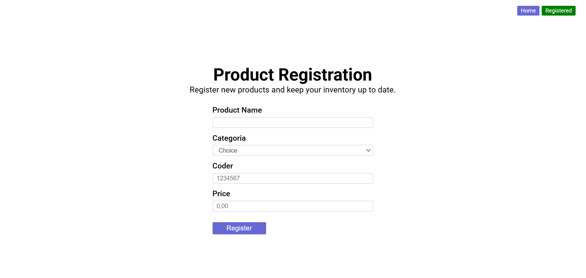
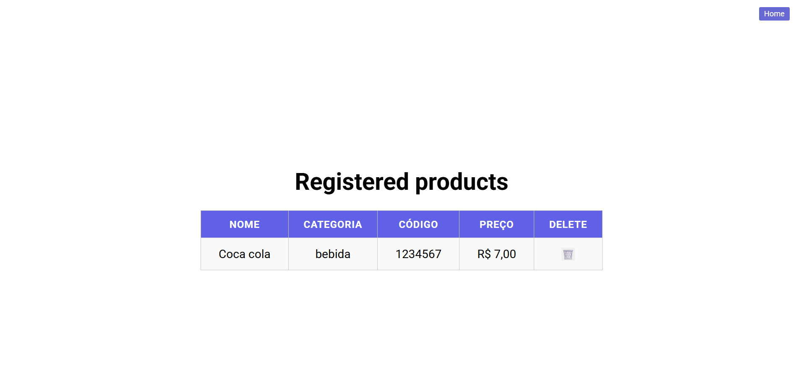

# 🛒 Product Register


> Um projeto simples e intuitivo para cadastrar, visualizar e excluir produtos — tudo direto no navegador, usando **JavaScript puro** e **localStorage**.

---

## 🌟 **Visão Geral**

O **Product Register** é um projeto desenvolvido para praticar e consolidar conhecimentos em **HTML**, **CSS** e **JavaScript**.  
Ele permite que o usuário registre produtos informando **nome**, **categoria**, **código** e **preço**, e visualize tudo de forma organizada em uma tabela.  
Os dados são salvos localmente no navegador, garantindo que as informações não se percam ao recarregar a página.

---

## 🖼️ **Demonstração do Projeto**

<div align="center">
  <a href="assets/demo.gif">
    
  </a>
  <br>
  <em>Clique no GIF para ver em tamanho real — cadastro e exclusão de produtos em ação!</em>
</div>

---

## ⚙️ **Funcionalidades**

✅ **Cadastro de produtos com validação inteligente**

- Nome: apenas letras e espaços
- Código: exatamente 7 números
- Preço: positivo e válido

✅ **Armazenamento local com localStorage**

- Persistência de dados sem servidor

✅ **Listagem organizada em tabela**

- Exibe nome, categoria, código e preço formatado em **R$**

✅ **Exclusão de produtos**

- Botão 🗑️ para remover produtos individualmente
- Confirmação opcional antes de deletar

✅ **Feedback visual ao usuário**

- Mensagens de sucesso e erro para orientar o usuário

---

## 🧩 **Tecnologias Utilizadas**

| Tecnologia             | Descrição                                     |
| ---------------------- | --------------------------------------------- |
| **HTML5**              | Estrutura e semântica                         |
| **CSS3**               | Layout e responsividade                       |
| **JavaScript (ES6)**   | Lógica de cadastro, validação e armazenamento |
| **jQuery Mask Plugin** | Máscara de entrada para preço                 |
| **localStorage API**   | Armazenamento local                           |

---

---

## 🎨 **Design e Usabilidade**

O projeto foi desenvolvido pensando em simplicidade e clareza:

- Layout centralizado e responsivo
- Botões com cores distintas e efeitos de hover
- Tabela com contraste para leitura fácil
- Mensagens dinâmicas para orientar o usuário

### 🖼️ Screenshots do Design

<div align="center">

<a href="assets/design/home.png">
  
</a>
<a href="assets/design/products.png">
  
</a>

<p><em>Clique nas imagens para ver em tamanho real</em></p>
</div>

---

## 🖥️ **Como Executar o Projeto**

1. **Clone o repositório**

```bash
git clone https://github.com/seu-usuario/product-register.git
cd product-register
```

---

💡Próximas Melhorias

- Editar produto
- Buscar e filtrar por nome ou categoria
- Confirmação antes de excluir
- Conectar com backend (Node.js ou Firebase)
- Tema escuro (dark mode)

<br>

---

🙌 Aprendizados

- Validação de entradas com regex
- Uso do localStorage para persistência de dados
- Prática de JavaScript moderno (ES6)
- Importância de uma UX clara e responsiva

<br>

---

<br>

## 🤝 Contribuindo

Contribuições são super bem-vindas!
Sinta-se livre para abrir issues ou enviar pull requests.

---

<br>

## 👩‍💻 Desenvolvido por

**Larissa Sthefany**
